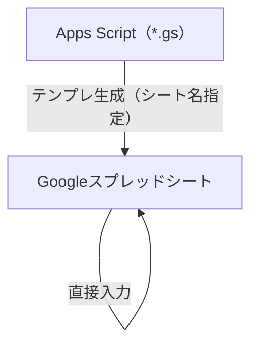

# プロダクトバックログ管理テンプレート（Google スプレッドシート）

**プロダクトバックログ**を**Google スプレッドシートで**管理し、**テンプレートの自動展開**と**ID 自動採番**を自動化するための **Google Apps Script** プロジェクトです。1 つのスプレッドシートに **シート名を指定して複数のバックログ**（例：レセハブアプリ、管理コンソール）を展開でき、各シートで独立した ID 採番（`onEdit` による自動採番）が行えます。

## 作業の流れ

1. メニュー「バックログ」→ **🆕 バックログシートを追加** で、シート名を指定してテンプレを展開する（同名シートがあればデータは保持）。
2. バックログシートに直接入力する（内容が入った時点で ID が自動採番される）。
3. シート名を変えて同じ操作を繰り返すと、複数のバックログを管理できる。



## 前提条件

- [mise](https://mise.jdx.dev/)（または Node.js + pnpm）
- Google アカウントで [Apps Script API](https://script.google.com/home/usersettings) を有効化しておく

## 環境構築

```bash
mise install   # Node.js / pnpm を導入（mise.toml に従う）
pnpm install   # clasp などの依存パッケージを導入
```

## 初回セットアップ（Google スプレッドシート）

### 1. コマンドを実行する

```bash
pnpm install
pnpm exec clasp login       # ブラウザでGoogleアカウント認証

# 新規に作る場合（.clasp.json が生成される）
pnpm exec clasp create-script --type sheets --title "プロダクトバックログ" --rootDir .

# 既存のスプレッドシートに紐付ける場合
#   .clasp.json の scriptId と parentId を書き換える
#   scriptId: Apps Script プロジェクトのID
#   parentId: スプレッドシートのID（URL の /d/XXXXX/ の部分）

pnpm exec clasp push --force
```

> [!NOTE]
> `clasp create-script` で生成した `.clasp.json` はこのファイル内のプレースホルダを参考に書き換えてください。

### 2. スプレッドシート側で操作する

1. スプレッドシートを開き、**再読み込み**する（メニューに「バックログ」が追加される）
2. メニュー「バックログ」→ **🆕 バックログシートを追加（名前を指定）** を実行する（シート名を聞かれるので入力する。初回は権限の承認が必要）
3. 指定名のバックログシート（+ 🔢 ID管理）ができ、ID 採番・プルダウンが有効になる
4. メニューをもう一度実行し、別のシート名を入れると**同じブックに複数のバックログ**を追加できる

## 注意事項

- 列・タブ構成をスプレッドシート上で直接変えると、ID 採番や入力規則が壊れる。変更は該当する `.gs` を編集して行う（下記「プロジェクト構成」参照）。
- `onEdit` による ID 自動採番は、プロジェクトに **編集トリガーを手動で追加しなくても** Apps Script の組み込み（シンプルトリガー）で動作する。
- 登録済みバックログシートのタブ名をスプレッドシート上で直接変えた場合は、メニュー「🔢 IDカウンタをブックから再同期」を実行する。

## プロジェクト構成

| ファイル | 役割 |
|----------|------|
| [`google-sheets-guide.md`](google-sheets-guide.md) | ブックの**編集・運用**、**ID** など。 |
| [`template-setup.gs`](template-setup.gs) | 定数、`createBacklogSheet`（シート名指定での展開処理）、共通UIヘルパー。**テンプレ全体の入口**。 |
| [`backlog-sheets.gs`](backlog-sheets.gs) | バックログシートのヘッダー・列幅・初期サンプル行の定義。 |
| [`ids.gs`](ids.gs) | 🔢 ID管理 シートの読み書き、シートごとの ID 採番、`onEdit` による自動採番。 |
| [`menu.gs`](menu.gs) | カスタムメニュー（`onOpen`）。シート追加・ID再同期の入口。 |
| [`validation.gs`](validation.gs) | ステータス・着手可能性・ポイント の入力規則。 |

## ライセンス

[MIT](LICENSE)
